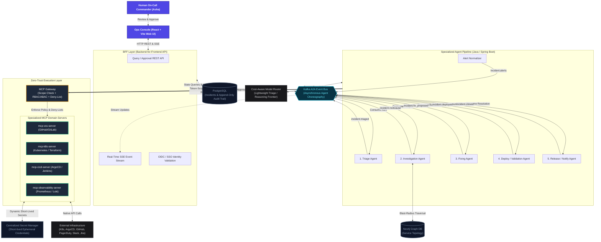

# Zero-Trust Agentic AI Operations Framework for Incident Management

> Based on the **Infra-Agnostic Intelligent Ops Framework** by Brajveer Singh.  
> An event-driven, multi-agent architecture where **autonomous speed meets enterprise-grade guardrails**.

---

## 1. Executive Summary & Core Philosophy

When production breaks at 2:00 AM, engineering teams face a classic dilemma: move fast and risk breaking more things, or move slow and watch downtime costs climb. Autonomous AI agents promise rapid resolution, but giving raw LLMs uncontrolled access to production infrastructure is a recipe for disaster.

This framework solves that dilemma through three foundational principles:
1. **Decoupled by Design (Kafka Choreography + BFF Layer)**: Agents coordinate asynchronously via an event bus; the browser is strictly isolated behind a Backend-for-Frontend (BFF) API.
2. **Zero-Trust Tool Enforcement (The MCP Gateway)**: Agents never hold static credentials or talk directly to external systems. All operational tools pass through a Policy-Enforced Model Context Protocol (MCP) Gateway.
3. **Multi-Stage Human-in-the-Loop (HITL) Guardrails**: Human oversight is applied across multiple lifecycle stages, not just at the end.

---

## 2. High-Level Architecture Diagram

---

## 3. Core Architectural Pillars

### 3.1 Decoupled by Design: Kafka Choreography + BFF Layer

Our architecture enforces two strict operational boundaries:

1. **No Direct Agent-to-Agent Coupling**:
   * Agents do not make brittle peer-to-peer HTTP calls.
   * Handoffs occur asynchronously across the Kafka event bus:
     $$\text{Alert} \rightarrow \text{Kafka} \rightarrow \text{Agent}_1 \rightarrow \text{Kafka} \rightarrow \text{Agent}_2 \rightarrow \dots$$
   * Each stage scales, fails, and retries independently without cascading failure.

2. **No Direct UI-to-Broker Access**:
   * The browser never speaks directly to Kafka.
   * A dedicated **Backend-for-Frontend (BFF)** layer aggregates incident telemetry, serves real-time updates via Server-Sent Events (SSE), and serves as the validation checkpoint for all human approvals.

---

### 3.2 The MCP Gateway: Zero-Trust Tool Enforcement

Agents should never hold static credentials or talk directly to production infrastructure. Every tool invocation routes through an **MCP (Model Context Protocol) Gateway**:

1. **Token-Scoped Access**:
   * Agents request tool execution using short-lived JWTs scoped to specific domain capabilities (e.g., `mcp:vcs:read`, `mcp:vcs:write`, `mcp:cicd:deploy`, `mcp:k8s:get`).
2. **Hard Policy Enforcement**:
   * The Gateway performs strict RBAC/ABAC and deny-list checks before forwarding requests (e.g., automated agents are unconditionally blocked from destructive operations like `k8s:deleteDeployment` or dropping database tables).
3. **Dynamic Secrets**:
   * Specialized MCP servers (`mcp-vcs-server`, `mcp-k8s-server`, etc.) retrieve short-lived, cluster- or repo-scoped credentials directly from a centralized secret manager (e.g., HashiCorp Vault). Zero credentials are hardcoded.

---

### 3.3 Multi-Stage Human-in-the-Loop (HITL) Guardrails

Enterprise safety means human oversight is not just an afterthought at the deployment phase. Our framework establishes checkpoints across multiple lifecycle stages:

| Stage | Gate Type | Trigger Condition | Operator Action in UI |
|---|---|---|---|
| **1. Triage Stage** | **Optional Gate** | High-severity incident (P1) or ambiguous service ownership | Operator confirms / reassigns responsible service team |
| **2. Investigation Stage** | **Automated** | Read-only analysis; LLM inputs sanitized via Responsible AI policies | None (fully autonomous observability queries & topology traversal) |
| **3. Fixing Stage** | **Conditional Gate** | Proposing destructive fixes, hotfix PRs, teardowns, or schema alterations | Operator reviews diff / rollback plan and clicks "Approve Patch" |
| **4. Deploy / Validation Stage** | **Mandatory Gate** | All production rollouts, traffic shifts, and canary promotions | Operator authorizes production execution |
| **5. Release / Notify Stage** | **Automated** | Outbound-only notification dispatch | None (automated updates to Slack, Jira, PagerDuty) |

---

### 3.4 Zero-Trust Identity & Auditing

* **User Authentication**: Corporate OIDC / IdP integration (Keycloak, Azure AD, Okta). The BFF validates JWT signatures on all operator requests.
* **Service Authentication**: Every microservice and agent authenticates via short-lived service tokens issued by a centralized secret manager with automatic rotation.
* **Append-Only Audit Trail**: PostgreSQL stores immutable audit records capturing:
  * Actor identity (agent vs. human operator)
  * Monotonic timestamp
  * Raw prompt and LLM response
  * Tool invoked, parameters, and MCP Gateway decision
  * Approval signature and decision rationale

---

### 3.5 Cost-Aware Model Routing

Running frontier models for every minor alert is unnecessarily expensive. The framework implements profile-based model routing:

* **Lightweight Models** (e.g., Claude 3.5 Haiku, Llama 3.3 70B, local Ollama):
  * Rapid alert normalization, classification, and triage.
* **Frontier Reasoning Models** (e.g., Claude 3.7 Sonnet, GPT-4o):
  * In-depth root cause analysis (RCA), log correlation, and minimal safe fix synthesis.

---

## 4. End-to-End Walkthrough: Checkout 5xx Surge Scenario

* **Persona**: Asha, Incident Commander

1. **Alert Ingestion**:
   * Prometheus triggers a 5xx surge alert on `checkout-service`.
   * The `Alert Normalizer` parses and enriches the alert payload, then publishes an `AlertIngestedEvent` to Kafka.
2. **Triage**:
   * The `Triage Agent` evaluates severity as **P1** with ambiguous cross-service impact.
   * It publishes a triage summary and flags an **Optional HITL Gate** via the BFF API.
3. **Ownership Approval (Gate 1)**:
   * Asha reviews the incident summary in the Ops UI and confirms service ownership.
   * The BFF writes an `OwnershipConfirmedEvent` to Kafka.
4. **Investigation**:
   * The `Investigation Agent` queries the Neo4j topology graph for downstream blast radius and pulls recent Loki logs via the Observability MCP server.
   * It correlates a deployment commit from 15 minutes prior as the root cause.
5. **Fix Proposal**:
   * The `Fixing Agent` drafts a rollback PR via `mcp-vcs-server`.
   * Because this touches production code, it flags a **Conditional HITL Gate**.
6. **Fix Approval (Gate 2)**:
   * Asha inspects the proposed Git diff in the UI and clicks **"Approve Patch"**.
   * The BFF writes a `FixApprovedEvent` to Kafka.
7. **Deploy Gate (Gate 3 - Mandatory)**:
   * The `Deploy / Validation Agent` prepares the rollback and triggers a **Mandatory Production Gate**.
   * Asha authorizes the production rollout.
   * The agent triggers the rollback via `mcp-cicd-server` (ArgoCD).
8. **Validation & Closure**:
   * The `Deploy / Validation Agent` monitors Prometheus metrics and confirms the 5xx rate has dropped under 0.5%.
   * The `Release / Notify Agent` automatically updates Jira and posts a resolution summary to Slack.

---

## 5. Technology Stack Summary

| Layer | Technology | Role |
|---|---|---|
| **Frontend** | React 19 + Vite | Real-time incident dashboard & HITL approval console |
| **Backend / BFF** | Java 21 + Spring Boot 3.3 (WebFlux) | BFF query API, SSE stream, OIDC JWT validation |
| **A2A Event Bus** | Apache Kafka / Redpanda | Decoupled asynchronous agent choreography |
| **Agentic Logic** | Java 21 + Spring AI | Specialized agents with cost-aware model routing |
| **Tool Gateway** | MCP Gateway (Model Context Protocol) | Token scoping, deny-list policy checks, secret injection |
| **Database** | PostgreSQL | Incidents repository and append-only audit ledger |
| **Topology** | Neo4j | Service dependency graph & blast-radius analysis |
| **Identity & Secrets** | Keycloak (OIDC) + HashiCorp Vault | Zero-Trust user authentication & dynamic credential rotation |
